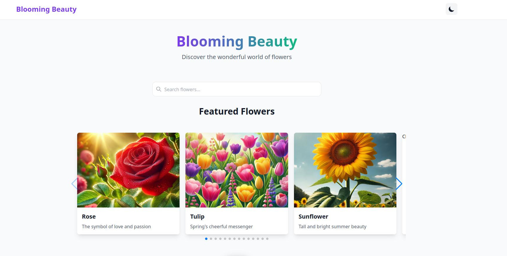

---

# 🌸 Astro Flower Catalog 🌸

Welcome to **Blooming Beauty**! 🌼 Discover the wonderful world of flowers with our educational flower catalog, built with **Astro** and **TypeScript**. This project is perfect for garden enthusiasts, botanists, and curious learners alike! 🚀

## 🌟 Features

- **Interactive Flower Carousel** 🌺 – Browse through our featured flowers with a visually appealing and interactive carousel.
- **Search Functionality** 🔍 – Easily search for your favorite flowers.
- **Detailed Flower Pages** 🌷 – Learn more about each flower with individual pages, featuring images and growing guides.
- **Responsive Design** 📱 – Beautiful on any device, from desktops to smartphones.

## 🛠️ Technologies Used

- **Astro** 🌌 – The modern static site builder designed for speed and flexibility.
- **TypeScript** 📘 – Ensuring type safety and better code quality.
- **CSV Parsing** 📄 – Loading data from CSV files for simplicity and flexibility.
- **Tailwind CSS** 🎨 – For a beautiful, responsive design.

## 🚀 Getting Started

1. **Clone the Repository** 🖥️  
   ```bash
   git clone https://github.com/yourusername/astro-flower-catalog.git
   ```
   
2. **Install Dependencies** 📦  
   ```bash
   cd astro-flower-catalog
   npm install
   ```

3. **Run the Development Server** 🏃‍♀️  
   ```bash
   npm run dev
   ```
   Visit `http://localhost:4329` (or whichever port Astro selects) in your browser to explore the flower catalog locally.

## 📁 Project Structure

```plaintext
astro-flower-catalog/
├── src/
│   ├── components/      # Reusable UI components like the Flower Carousel 🌼
│   ├── data/            # CSV data for flowers 📄
│   ├── images/          # Flower images 📸
│   ├── layouts/         # Page layouts 📄
│   ├── pages/           # Flower catalog pages 🌸
│   └── styles/          # Tailwind CSS styling 🎨
├── public/              # Static assets for the site 🌐
└── astro.config.mjs     # Astro configuration 🌌
```

## 🎓 Educational Aspects

- **Component-Based Architecture** 🧩 – This project is structured around reusable components, such as `FlowerCard` and `FlowerCarousel`. Learn how to design modular, scalable UI elements!
- **Static Site Generation** ⚡ – Utilizing Astro's powerful static generation capabilities, making the site blazing fast and SEO-friendly.
- **Data-Driven Pages** 📊 – Flower details are dynamically generated based on CSV data, demonstrating how to integrate file-based data into web applications.

## 👀 Live Preview

Check out the live demo here: [Blooming Beauty Flower Catalog](https://astro-flower-catalog.vercel.app/) 🌐

## 🙏 Contributing

Contributions are welcome! Feel free to open issues, submit PRs, or suggest features. Let's make the world of flowers more accessible and beautiful together! 🌹

## 📜 License

This project is licensed under the MIT License. See the [LICENSE](LICENSE) file for more details.


---

Enjoy browsing our flower catalog, and happy gardening! 🌻
